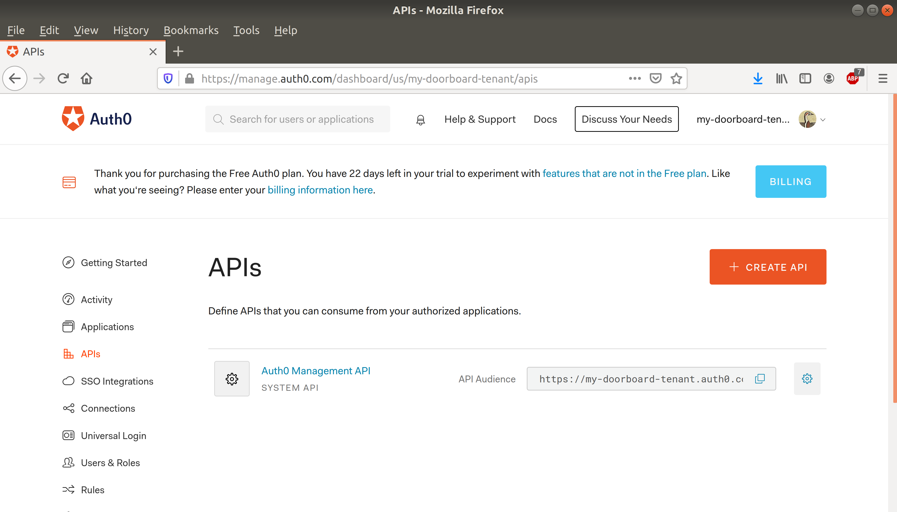

# Deployment

To deploy this project, you're going to need to acquire a server running some flavor of Linux. You'll need the `docker-compose` and `git` commands; depending on your distribution, you may need to install these onto the server before continuing.

You're also going to need a domain name that points to your server's IP address. (If you don't want to buy a domain name, consider using [nip.io](https://nip.io/); this is a website with the property that, if you take an arbitrary IP address—say, 172.105.105.10—the domain name `172.105.105.10.nip.io` will automatically point to that IP address.)

Let's suppose we're using the domain **`172.105.105.10.nip.io.`**

## Authentication

This project uses the identity service Auth0 for authentication. To use this service, you'll need to create an account at [auth0.com](https://auth0.com/). They will ask you to create a "tenant domain" of the form `something.auth0.com`. (This is where your login page and related URLs will live.) Choose whatever name you want, and write it down.

Let's suppose our tenant domain is **`my-doorboard-tenant.auth0.com`**.

You should be redirected to your Auth0 dashboard, which looks like this:


To deploy the project, you're going to need to create two things: first, an application, under the "Applications" page, and second, an API, under the "APIs" page. (The Application contains settings for the client-side; the API contains settings for the server-side.)

### Creating an application with Auth0

When you go to the applications page, you'll see that there's already an application named "Default App". This is just a placeholder; you can safely ignore it, or delete it if you want.

What you want to do is click the big orange "CREATE APPLICATION" button:


You can give the Application any name you want, but be aware that this name will be publicly shown when the user logs in. This is an Angular project, so when prompted about the application type, select "Single-Page Web Applications".


After you create your Application, you'll be brought to this page:


You can safely ignore the Quick Start—it's just a guide to how to use Auth0 in your codebase. Instead, you should take a look at the "Settings" tab.

There are five fields you need to set here.

 1. "Application Logo" should be set to `https://raw.githubusercontent.com/UMM-CSci-3601-S20/it-3-007/master/client/src/favicon.svg`, which points to the favicon as it appears in our GitHub repository. (You can also use a different image, if you so choose.)
 2. "Application Login URI" should be set to the root URL of the webpage, including the protocol. In our case, that's `https://172.105.105.10.nip.io`.
 3. "Allowed Callback URLs" should be a comma-separated list containing two items: First, `http://localhost:4200`, and second, the root URL of the webpage—which, again, is `https://172.105.105.10.nip.io` in our case. (The localhost URL is included in case you want to test the project on your own computer before deploying. If you're only ever going to run the project on a server, it may be safely omitted.)
 4. "Allowed Logout URLs" should be exactly the same as "Allowed Callback URLs": `http://localhost:4200, https://172.105.105.10.nip.io`.
 5. "Allowed Web Origins" should be exactly the same as "Allowed Callback URLs": `http://localhost:4200, https://172.105.105.10.nip.io`.

(You can leave "Allowed Origins (CORS)" empty.)

When you're finished, the applications settings should look like this:


*Remember to click the big blue "SAVE CHANGES" button at the bottom of the page! Otherwise, none of these settings will take effect.*

Also on the settings page, you'll find a randomly-generated Client ID; remember this value. In our example, the Client ID we got was **`fnDD76W87Xst7GsUrg0LbxOfIncrgLLz`**. (The Client ID isn't secret.)

You may also wish to look at the "Connections" tab and configure the settings there to your likings. By default, Auth0 is set up to let you create your own username and password, or to let you log in with Google, but you can add or remove login options as you see fit.

If you use anything other than username-password login, you should strongly consider acquiring your own API keys for the relevant websites. If you don't, Auth0 will provide you with "development" keys, but these aren't really meant for production use, and they may not work correctly.

When setting up social login options, it's important to keep in mind that DoorBoard is designed to be used within a single organization: it assumes that the local-part of users' email addresses (the part before the at-sign) is globally unique. If possible, you may wish to restrict login so that only users from a single organization may create accounts.

### Creating an Application with Auth0

Next, you'll want to head over to the "APIs" page, and click the big orange "CREATE API" button:



When filling out the information, the friendly name can be anything you want, but the identifier should be of the form `https://<your domain name>/api/`. (In our example, the identifier will be **`https://172.105.105.10.nip.io/api/`**.) Make sure you use the default signing algorithm, RS256.


After creating the API, you should be good to go! You don't need to change any settings.

## Getting the code

Next, you need to get the project's code onto your server. You can do this by running

```sh
git clone https://github.com/UMM-CSci-3601-S20/it-3-007.git
cd it-3-007
```

However, before compiling and running the project, you'll need to change a few files.

First, you should create a file in the `it-3-007` directory (the root of the project) named `.env`, with the following 3 lines:

```
APP_HOST=<your domain name>
APP_ACME_AGREE=true
APP_TLS_EMAIL=<your email>
```

This file is used to set up Let's Encrypt certificates, so that your server can use HTTPS. In our example, our `.env` file looks like this:

```
APP_HOST=172.105.105.10.nip.io
APP_ACME_AGREE=true
APP_TLS_EMAIL=walbr037@morris.umn.edu
```

Next, you need to edit a few constants in the code so that it uses your URLs.

First, you want to change the file `client/src/environments/environment.prod.ts`, which tells the client-side what URLs to use in production. You'll want to change lines 4, 5, 6, and 7, setting these fields to the root URL of your website (including the protocol), your Auth0 tenant domain, your Auth0 Client ID, and your Auth0 API Identifier, respectively. In our example, the `environment.prod.ts` file looks like this:

*Note: whether or not any given URL has a trailing slash is very important. Make sure you exactly match the pattern shown here.*

```ts
export const environment = {
  production: true,
  API_URL: '/api',
  BASE_URL: 'https://172.105.105.10.nip.io',
  AUTH_DOMAIN: 'my-doorboard-tenant.auth0.com',
  AUTH_CLIENT_ID: 'fnDD76W87Xst7GsUrg0LbxOfIncrgLLz',
  AUTH_API_DOMAIN: 'https://172.105.105.10.nip.io/api/',
};
```

Next, you probably also want to change the file `client/src/environments/environment.ts`, which tells the client-side what URLs to use when running the project locally. You'll want to change lines 12, 13, and 14, setting these fields to your Auth0 tenant domain, your Auth0 Client ID, and your Auth0 API Identifier, respectively. In our example, the `environment.ts` file should look like this:

```ts
export const environment = {
  production: false,
  API_URL: '/api',
  BASE_URL: 'http://localhost:4200',

  // Authentication variables, please change if you're using this code base for a different iteration
  // Change them both here and in 'environment.prod.ts'
  AUTH_DOMAIN: 'my-doorboard-tenant.auth0.com',
  AUTH_CLIENT_ID: 'fnDD76W87Xst7GsUrg0LbxOfIncrgLLz',
  AUTH_API_DOMAIN: 'https://172.105.105.10.nip.io/api/',
};
```


You'll need to edit line 23 of `server/src/main/java/umm3601/TokenVerifier.java`, setting the `AUTH0_TENANT` field to the URL of your Auth0 tenant (including the protocol). In our example, `TokenVerifier.java` looks like this:

```java
public class TokenVerifier {

  private JwkProvider provider;

  public static final String AUTH0_TENANT = "https://my-doorboard-tenant.auth0.com/";

  ...
}
```

Finally, you'll need to edit `server/src/main/java/umm3601/Server.java`. You'll need to edit line 27 of this file, setting the `BASE_URL` field to the root URL of your website (including the protocol). In our example, the `Server.java` file looks like this:

```java
public class Server {

  private static MongoDatabase database;

  /**
   * This is the absolute URL of the root of our website (including the
   * protocol, without a trailing slash).
   *
   * If we get a new domain name, we'll need to change this value.
   */
  public static final String BASE_URL = "https://172.105.105.10.nip.io";
  
  ...
}
```

## Compiling and running the project

After you've made these changes, you can deploy it to the web by going to the root of the project (the `it-3-007` directory) and running the command

```sh
docker-compose up -d --build
```

Then, your project should be up and running!

To stop the project, you can run

```sh
docker-compose down --rmi all
```
